<!-- English mirror generated from current profile -->

  <picture>
    <source media="(max-width: 760px) and (prefers-color-scheme: dark)" srcset="./assets/hero/agent-console-ddfddcca-mobile-dark.svg">
    <source media="(max-width: 760px)" srcset="./assets/hero/agent-console-ddfddcca-mobile-light.svg">
    <source media="(prefers-color-scheme: dark)" srcset="./assets/hero/agent-console-ddfddcca-dark.svg">
    <source media="(prefers-color-scheme: light)" srcset="./assets/hero/agent-console-ddfddcca-light.svg">
    
  </picture>

<h1 align="center">Ismael Farah — Software Engineer</h1>

Building practical backend systems and AI-powered products with a creative engineering touch.

  

---

## Featured Projects

| Project | Focus | Tech |
| --- | --- | --- |
| [Next AI Draw.io](https://github.com/IsmaelFarah88/next-ai-draw-io) | AI diagram editor | TypeScript, Next.js |
| [ClinicSystemAPI](https://github.com/IsmaelFarah88/ClinicSystemAPI) | Clinic management API | ASP.NET Core, C# |
| [Case-study](https://github.com/IsmaelFarah88/Case-study) | AI web app with Gemini integration | JavaScript |

---

## GitHub Stats

  
  

---

## Contact

  
  
  

---

_This file is an English mirror. Switch to the Arabic README for a localized experience._
